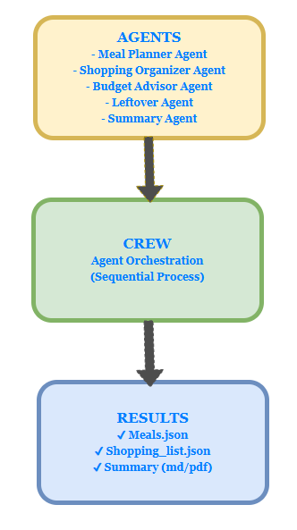
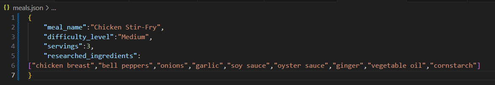
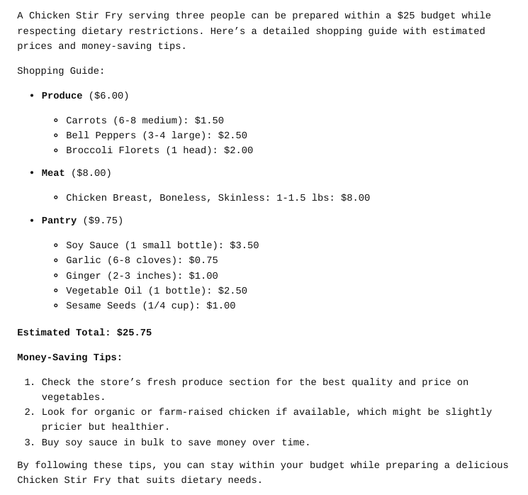
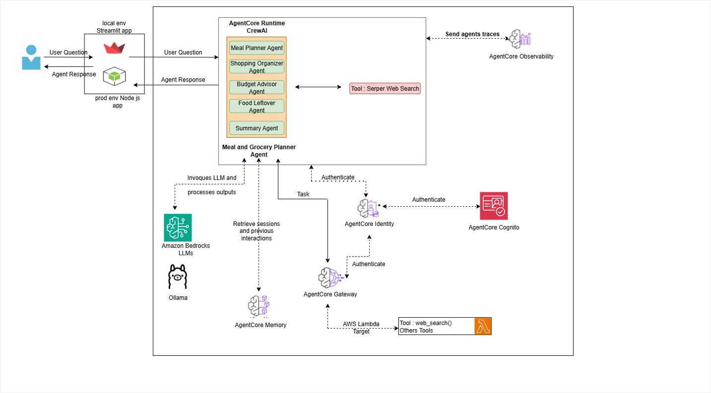

# Multi Agent Meal Grocery Planner 🥗🛒 with CrewAI

**Meal Grocery Planner** is an AI-driven application designed to help users automatically generate weekly meal plans, organize grocery shopping lists, validate budget constraints, and suggest leftover usage.  
The system leverages [CrewAI](https://github.com/joaomdmoura/crewai) to orchestrate multiple specialized **agents** working together in a collaborative workflow.

---

## 📌 Table of Contents
- [Overview](#overview)
- [Architecture](#architecture)
- [Agents](#agents)
- [Getting Started](#getting-started)
- [Development](#development)
- [Docker Support](#docker-support)
- [Infrastructure (Terraform)](#infrastructure-terraform)
- [Tests](#tests)
- [Documentation](#documentation)
- [Contributing](#contributing)
- [License](#license)

---

## Overview
The **Meal Grocery Planner** automates the process of:
- Generating personalized meal plans
- Organizing grocery items by categories
- Verifying adherence to a defined budget
- Minimizing waste via leftover reuse
- Summarizing all steps in a simple, consolidated report

This project demonstrates how **AI Agents** can collaborate under a Crew orchestrator to deliver real-world, production-ready solutions.

 

---

## Architecture
The workflow follows a **sequential process**:

1. **Meal Planner Agent**  
   Generates a structured meal plan (ingredients, servings, complexity).
   

2. **Shopping Organizer Agent**  
   Converts planned meals into a categorized shopping list by store sections.
    

3. **Budget Advisor Agent**  
   Checks the grocery list against the available budget and suggests optimizations.

4. **Leftover Agent**  
   Proposes leftover-based meals to reduce waste.

5. **Summary Agent**  
   Consolidates all results into a user-friendly output.

📊 **Diagram**:  



---

## Agents

### Meal Planner Agent
- **Purpose**: Creates weekly meal plans (names, servings, difficulty level, ingredients).
- **Output**: `meals.json`

### Shopping Organizer Agent
- **Purpose**: Organizes meals into shopping categories (e.g., Produce, Dairy, Meat).
- **Output**: `shopping_list.json`

### Budget Advisor Agent
- **Purpose**: Ensures the planned groceries respect the user’s budget, suggests cheaper alternatives.
- **Output**: `shopping_guide.md`

### Leftover Agent
- **Purpose**: Generates ideas to reuse leftovers efficiently.
- **Output**: JSON/Markdown suggestions

### Summary Agent
- **Purpose**: Aggregates results from other agents into a final summary.
- **Output**: Markdown or JSON

---

## Getting Started

### Prerequisites
- Python 3.11+
- [uv](https://github.com/astral-sh/uv) package manager
- Optional: Docker & Terraform for infra

### Install Dependencies
```bash
uv sync
```

---

## Run Locally
```bash
uv run python main.py
```
---

## Development
### Linting

We use Ruff for linting:

```bash
ruff check . --fix
```
---

## Tests

We use pytest for unit testing:

```bash
uv run pytest
```
---

## Docker Support

The project includes a Dockerfile to containerize the app.

Build the Docker image:

```bash
docker build -t meal-grocery-planner -f infra/Dockerfile .
```

Run it :

```bash
docker run --rm meal-grocery-planner
```
---

## Infrastructure (Terraform)
Infrastructure is codified under terraform/ for AWS deployment with ECS Fargate & Application Load Balancer.

Steps:

- Build & push Docker image to ECR.
- Configure variables in terraform/environments/dev.tfvars.
- Deploy:

```bash
cd infra/terraform
terraform init
terraform apply -var-file=environments/dev.tfvars
```
Output:

```bash
alb_dns_name = meal-grocery-planner-alb-xxxx.eu-west-1.elb.amazonaws.com
```
---

## Documentation
Additional docs are available under the docs/ directory:

- agents.md → Detailed description of each Agent
- architecture.md → Architecture overview & diagram
- screenshots/ → Illustrations & sample outputs

---

## Contributing
We welcome contributions! Please fork the repo, create a feature branch, and submit a pull request.
Before committing, run linting and tests:
```bash
ruff check . --fix
uv run pytest
```

## License
This project is licensed under the [MIT License](https://opensource.org/licenses/MIT).

Author
Developed by [David TCHATCHOUA](https://frenchtechacademie.fr/tchatchoua) — AI Engineer - AI Agents Builder.