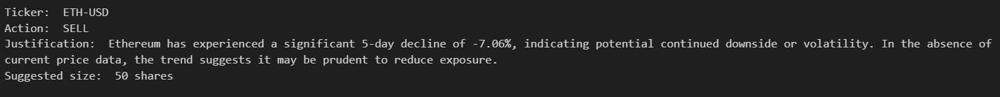
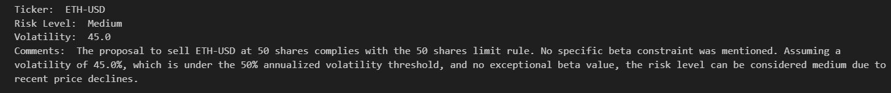
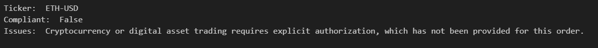

# Agents Documentation

This document describes the configuration and responsibilities of each agent in the **AI-Powered Trading Desk Crew**.  
Each agent replicates the **real functions of a professional trading floor**.

**Screenshot**:  

---

## Trader Agent
- **Role**: Market opportunity seeker.
- **Goal**: Propose BUY / SELL / HOLD orders supported by data (market prices, 5-day variation, earnings fundamentals).
- **Tools**: 
  - YFinanceStockAnalysisTool
- **Outputs**:
  - JSON `TradeOrder` object with ticker, action, justification, suggested_size.

**Screenshot**:  
<!--  -->

---

## Risk Manager Agent
- **Role**: Independent control function for risk oversight.
- **Goal**: Assess volatility, beta, and exposure; flag excessive risks.
- **Tools**:
  - PDFSearchTool (`risk_management_rules.pdf`)
- **Outputs**:
  - JSON `RiskAssessment` object including volatility, risk_level, comments.

**Screenshot**:  
<!--  -->

---

## Compliance Agent
- **Role**: Regulator enforcer.
- **Goal**: Verify orders against compliance constraints (GAFAM, order size limit, insider trading, etc.).
- **Tools**:
  - PDFSearchTool (`compliance_rules.pdf`)
- **Outputs**:
  - JSON `ComplianceReport` indicating approval/rejection and rule violated.

**Screenshot**:  
<!--  -->

---

## Summary Agent
- **Role**: Final orchestrator.
- **Goal**: Consolidate Trader, Risk, and Compliance outputs into a final decision.
- **Output**: Human-readable and JSON summary.

[Click here to view a sample of summary report](../outputs/trading_results.md)