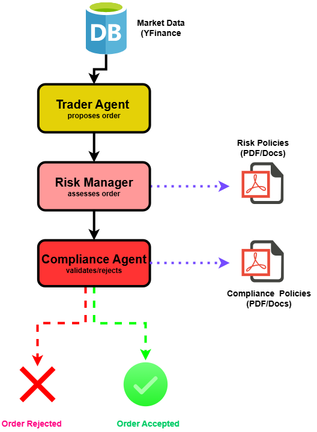

# 🏗️ System Architecture - Trading Desk Crew

This section details the architecture of the **multi-agent trading desk**.

---

## High-Level Overview

---

## Data Flow
1. **Trader Agent** fetches data (YFinance).  
2. **Risk Manager** validates size, volatility, beta.  
3. **Compliance Agent** enforces policy docs (PDFSearchTool).  
4. **Summary Agent** aggregates into a final recommendation.  

---

## Tech Stack
- **Agents Framework**: [CrewAI](https://github.com/joaomdmoura/crewai)  
- **Vector DB / RAG**: ChromaDB  
- **LLM**: Ollama (`llama2`)  
- **Embeddings**: OpenAI or Ollama (`nomic-embed-text`)  
- **Tools**: 
  - YFinanceStockAnalysisTool
  - PDFSearchTool  

---

## Production Architecture on AWS

<!--  -->

